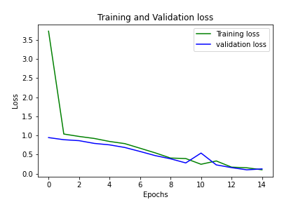

# Convolutional Model for Alzheimer Detection

Alzheimer's is a type of dementia that affects memory, thinking and behavior. Symptoms eventually grow severe enough to interfere with daily tasks. **Alzheimer's is the most common cause of dementia**. Alzheimer's disease accounts for 60-80% of dementia cases.

Alzheimer's is a progressive disease, where dementia symptoms gradually worsen over a number of years. In its early stages, memory loss is mild, but with late-stage Alzheimer's, individuals lose the ability to carry on a conversation and respond to their environment. Alzheimer's is the sixth-leading cause of death in the United States. On average, a person with Alzheimer's lives 4 to 8 years after diagnosis but can live as long as 20 years, depending on other factors.

No treatments stop or reverse its progression, though some may temporarily improve symptoms. Affected people increasingly rely on others for assistance, often placing a burden on the caregiver. The pressures can include social, psychological, physical, and economic elements. Exercise programs may be beneficial with respect to activities of daily living and can potentially improve outcomes. Behavioral problems or psychosis due to dementia are often treated with antipsychotics, but this is not usually recommended, as there is little benefit and an increased risk of early death.

There are 7 different stages of Alzheimer:

- **Stage** 1: Normal Outward Behavior.
- **Stage** 2: Very Mild Changes.
- **Stage** 3: Mild Decline.
- **Stage** 4: Moderate Decline.
- **Stage** 5: Moderately Severe Decline.
- **Stage** 6: Severe Decline.
- **Stage 7**: Very Severe Decline.

## Dataset

The dataset is from [kaggle](https://www.kaggle.com/tourist55/alzheimers-dataset-4-class-of-images). The author collected data from various websites with each and every labels verified.

The data consists of MRI images. The data has four classes of images both in training as well as a testing set:

1. Mild Demented

2. Moderate Demented

3. Non Demented

4. Very Mild Demented

### Exploratory Data Analysis (EDA)

Data is divided into train, test and validation set. `ImageDataGenerator` is used for rescaling:

```python
train = ImageDataGenerator(rescale=1./255)
test = ImageDataGenerator(rescale=1./255)
val = ImageDataGenerator(rescale=1./255)
```

```python
train_data = tf.keras.preprocessing.image_dataset_from_directory(
    train,
    validation_split=0.2,
    image_size=(224,224),
    batch_size=32,
    subset='training',
    seed=1000
    )
```

###### Output:

```
Found 5121 files belonging to 4 classes.
Using 4097 files for training.
```

```python
test_data=tf.keras.preprocessing.image_dataset_from_directory(
    test,
    image_size=(224,224),
    batch_size=32,
    seed=1000
    )
```

###### Output:

```
Found 1279 files belonging to 4 classes.
```

```python
val_data = tf.keras.preprocessing.image_dataset_from_directory(
    val,
    validation_split=0.2,
    image_size=(224,224),
    batch_size=32,
    subset='validation',
    seed=1000
    )
```

###### Output:

```
Found 5121 files belonging to 4 classes.
Using 1024 files for validation.
```

This dataset contains 4 classes of images:

```python
class_names = ['Mild Dementia', 'Moderate Dementia', 'Non Dementia', 'Very Mild Dementia']
```

###### Sample visualization:


###### Define Model:

```python
model=Sequential()

model.add(Conv2D(16,(3,3), activation='relu', input_shape=(224,224,3)))
model.add(MaxPooling2D(pool_size=(2, 2)))
model.add(Conv2D(32,(3,3), activation='relu'))
model.add(MaxPooling2D(pool_size=(2, 2)))
model.add(Conv2D(64,(3,3), activation='relu'))
model.add(MaxPooling2D(pool_size=(2, 2)))
model.add(Conv2D(128,(3,3), activation='relu'))
model.add(MaxPooling2D(pool_size=(2, 2)))
model.add(Flatten())
model.add(Dense(512,activation='relu'))
model.add(Dropout(0.2))
model.add(Dense(256,activation='relu'))
model.add(Dropout(0.2))
model.add(Dense(128,activation='relu'))
model.add(Dropout(0.2))
model.add(Dense(64,activation='relu'))
model.add(Dense(4,activation='softmax'))

model.summary()
```

###### Model Summary:

```python
Model: "sequential"
_________________________________________________________________
Layer (type)                 Output Shape              Param #   
=================================================================
conv2d_11 (Conv2D)           (None, 222, 222, 16)      448       
_________________________________________________________________
max_pooling2d_11 (MaxPooling (None, 111, 111, 16)      0         
_________________________________________________________________
conv2d_12 (Conv2D)           (None, 109, 109, 32)      4640      
_________________________________________________________________
max_pooling2d_12 (MaxPooling (None, 54, 54, 32)        0         
_________________________________________________________________
conv2d_13 (Conv2D)           (None, 52, 52, 64)        18496     
_________________________________________________________________
max_pooling2d_13 (MaxPooling (None, 26, 26, 64)        0         
_________________________________________________________________
conv2d_14 (Conv2D)           (None, 24, 24, 128)       73856     
_________________________________________________________________
max_pooling2d_14 (MaxPooling (None, 12, 12, 128)       0         
_________________________________________________________________
flatten_3 (Flatten)          (None, 18432)             0         
_________________________________________________________________
dense_18 (Dense)             (None, 512)               9437696   
_________________________________________________________________
dropout_6 (Dropout)          (None, 512)               0         
_________________________________________________________________
dense_19 (Dense)             (None, 256)               131328    
_________________________________________________________________
dropout_7 (Dropout)          (None, 256)               0         
_________________________________________________________________
dense_20 (Dense)             (None, 128)               32896     
_________________________________________________________________
dropout_8 (Dropout)          (None, 128)               0         
_________________________________________________________________
dense_21 (Dense)             (None, 64)                8256      
_________________________________________________________________
dense_22 (Dense)             (None, 4)                 260       
=================================================================
Total params: 9,707,876
Trainable params: 9,707,876
Non-trainable params: 0
_________________________________________________________________
```

###### Compile and Fit Model:

```python
model.compile(
    optimizer = tf.keras.optimizers.Adam(1e-4), 
    loss="sparse_categorical_crossentropy", 
    metrics=["accuracy"])

history = model.fit(
            train_data, 
            validation_data=val_data, 
            epochs=15)
```

```python
model.save("alz_model1.h5")
```

```python
model.evaluate(val_data)
```

###### Output:

```python
32/32 [==============================] - 1s 35ms/step - loss: 0.3533 - accuracy: 0.8672
[0.3533317744731903, 0.8671875]
```

###### Plot: Training and validation loss



###### Plot: Training and validation accuracy


###### Prediction Comparison:


